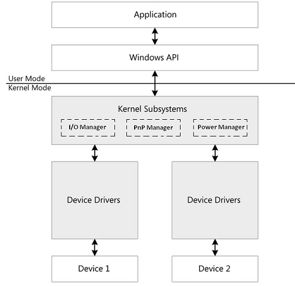
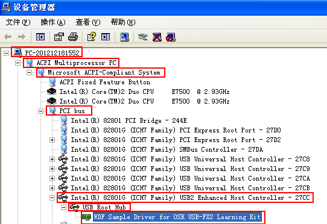
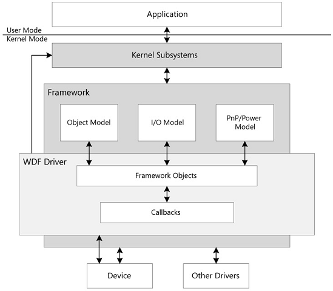
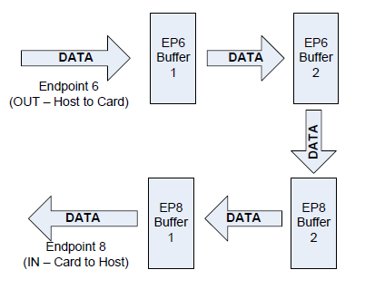
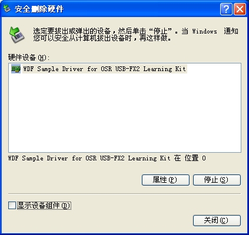

# **Step by Step, 为OSRFX2创建一个KMDF驱动程序**

***特别提醒：从本文撰写的目的角度出发，在一些理论描述上并不想简单地对MSDN上那些大而全的描述进行全文照搬，而是想结合OSRUSBFX2这个例子介绍一些和编写KMDF功能驱动相关的并且在笔者看来重要且常见的概念。所以如果读者发现本文的描述和MSDN的描述有出入，还是应该以MSDN为准。为此本文在正文中如果觉得需要读者去参考MSDN的时候，会给出MSDN的相关主题描述地址，以供甄别。***

## 总目录
###[**Chapter 1. 基础知识**](#chapter-1)  

[**1.1 Windows驱动的一些基本知识**](#1.1)  
[1.1.1 Windows系统架构](#1.1.1)  
[1.1.2 设备对象和设备栈](#1.1.2)  
[1.1.3 设备节点和设备树](#1.1.3)

[**1.2 WDF简介**](#1.2)  
[1.2.1. 设计良好的对象模型](#1.2.1)  
[1.2.2. 统一的I/O模型](#1.2.2)  
[1.2.3. 即插即用（PnP）和电源（Power）管理模型](#1.2.3)  

###[**Chapter 2. OSRUSBFX2 - Step By Step**](#chapter-2)  

[**2.1. Step1 - 创建一个最简单的KMDF功能驱动**](#2.1)  
[2.1.1. 驱动入口点DriverEntry](#2.1.1)  
[2.1.2. 添加新设备入口点EvtDriverDeviceAdd](#2.1.2)  

[**2.2. Step2 - 准备设备对象**](#2.2)  
[2.2.1. 为OSRFX2注册设备接口(device interface](#2.2.1)  
[2.2.2. 为OSRFX2添加上下文](#2.2.2)  
[2.2.3. 为OSRFX2准备I/O目标对象](#2.2.3)  

[**2.3. Step3 - USB同步控制传输**](#2.3)  
[2.3.1. 注册I/O控制码](#2.3.1)  
[2.3.2. 添加队列](#2.3.2)  
[2.3.3. 处理I/O控制](#2.3.3)  

[**2.4. Step4 - USB异步批量传输**](#2.4)  
[2.4.1. 注册回调函数](#2.4.1)  
[2.4.2. 添加I/O Target对象](#2.4.2)  
[2.4.3. 异步I/O请求处理](#2.4.3)  

[**2.5. Step5 -  为驱动加上日志跟踪**](#2.5)  
[2.5.1. Windows软件跟踪预处理器-WPP](#2.5.1)  
[2.5.2. 为驱动添加支持WPP](#2.5.2)  
[2.5.3. 使用TraceView观察WPP日志打印](#2.5.3)  

###[**Chapter 3. Final -  OSRUSBFX2的最终版本**](#chapter-3)

[**3.1. 优化读和写**](#3.1)  
[3.1.1. 完善驱动的读写队列](#3.1.1)  
[3.1.2. 测试程序的同步和异步读写](#3.1.2)    

## ***Chapter 1. 基础知识***
[返回总目录](#contents) 

### 1.1 Windows驱动的一些基本知识
[返回总目录](#contents) 

在进入WDF之前，我们有必要先回顾并深刻了解Windows这个操作系统和驱动相关的一些基本知识。WDF虽然很抽象很高级，但拨开其面纱，内部仍然是万变不离其宗，并没有离WDM太远。

### 1.1.1 Windows系统架构
[返回总目录](#contents) 

在Windows系统中，如果以分层的角度去看待一个I/O请求的执行路径，从上到下依次可以包括如下5层：  
1. 应用程序（Application），发起一个I/O请求。  
2. Windows API，可以主要理解为Win32 API。运行在用户态的应用程序不可以直接访问内核态的模组，但它们可以通过调用Win32 API发起I/O请求。  
3. 内核子系统（Kernel Subsystems），Windows内核的主要组成部分，I/O请求的执行路径至此从用户态进入内核态。如果内核可以直接处理用户的I/O请求则执行路径结束，否则内核子系统会调用驱动的处理函数将I/O请求转交给驱动处理。内核子系统提供了很多驱动开发接口DDI供驱动调用。在Windows的众多内核子系统中，驱动主要和以下三个子系统打交道。  
    - I/O管理器（I/O Manager），主要责任是将应用程序发起的I/O请求发给对应的驱动或者反之将驱动从物理设备收到的应答返回给应用程序。  
    - 即插即用管理器（PnP Manager），处理设备插拔事件，还要负责构造或者析构设备栈（device stack）。  
    - 电源管理器（Power Manager），处理PC的电源状态管理，比如休眠，恢复等等。  
4. 驱动，如果驱动可以处理I/O请求，则执行路径到此结束，否则驱动将I/O请求继续发送给设备。注意在WDF架构里驱动并不会直接和设备打交道，而是要通过内核子系统。我们这里的图只是给出了分层的概念。  
5. 物理设备，I/O请求最后的执行者。

### 1.1.2 设备对象和设备栈
[返回总目录](#contents) 

在Windows系统中，一个物理设备要正常工作，往往需要多个驱动的支持。PnP管理器检测到一个物理设备连接到系统总线后，从枚举设备的总线驱动开始，先创建最底层的物理设备对象（Physical Device Object，简称PDO），然后在系统中按照栈的形式从下到上调用对应驱动的AddDevice，为每一个驱动对应地创建一个设备对象。所以除了极少情况（Raw Mode）每一个设备栈都至少包括一个PDO，一个FDO以及零个或多个Filter DO,见下图。详细的过程描述可以参考[When Are WDM Device Objects Created?]  
  
设备栈建立好之后，当I/O管理器从应用程序收到一个I/O请求时，会按照这个栈的顺序将I/O请求依次向下转发给各级设备对象，直到在某一层被处理结束。设备对象作为I/O管理器和驱动程序之间的代理，其数据结构中包含了驱动注册的回调函数指针集合。I/O管理器通过这些回调函数和我们的驱动交互，调用我们驱动实现的功能函数。  
考虑到一台PC同时可能会处理多个相同的设备，所以我们的驱动代码要考虑同时支持多个设备栈。但每个设备栈只对应着连在系统上的一个物理设备。  

有关设备栈的更详细的描述可以参考[device stack]。

### 1.1.3 设备节点和设备树
[返回总目录](#contents) 

PnP管理器为每个设备栈在内存中保存了一份拷贝，除了设备对象的信息，还有一些系统内部维护使用的信息，比如设备是否已经启动等等。总的数据结构被称为设备节点[devnode]。  

一个设备节点只能表达一个总线上的一个设备的信息。而从系统的角度来看，整个系统里往往由多层总线叠加组成。所以多层总线以及每层总线上的多个设备就构成了一棵多个设备节点构成的大树。这棵树的信息由PnP管理器维护。有关设备树的更详细的描述可以参考[Device Tree]。

查看设备树除了用WinDbg，其实粗略地用设备管理器也可以看个大概，下图就是在一台XP电脑上从Root节点到OSRFX2设备的例子。从根节点“PC-201212181552”开始一路向下直到“WDF Sample Driver for OSR USB-FX2 Learning Kit”，每一个节点(红色方框标出)都对应着一个设备栈：  
  

对于OSRFX2设备“WDF Sample Driver for OSR USB-FX2 Learning Kit”, 其对应的设备栈示意图应该如下,其中PDO由USB Root Hub对应的Windows自带的usbhub.sys驱动创建，而FDO由osrusbfx2.sys驱动负责创建：  

### 1.2 WDF简介
[返回总目录](#contents) 

Windows Driver Foundation (WDF)是Windows上开发驱动的最新架构。基于这个架构我们可以开发用户态的驱动程序（UMDF），也可以开发内核态的驱动程序（KMDF）。

WDF为各种各样的设备类型抽象了一个统一的驱动模型，这个模型的最最重要的特性可以概括为三个主要的关键模型:  

 - **对象模型(Object Model)**；  
 - **I/O模型(I/O Model)**;  
 - **PnP/Power模型(PnP/Power Model)**  

之所以称其为统一，还有一方面的意思是，如果我们基于WDF来开发驱动，那么规范是已经定义好的，所有的WDF驱动都要在这个框架下根据WDF定义的接口和行为操作，否则就不能享受WDF给我们带来的福利。  

#### 1.2.1. 设计良好的对象模型
[返回总目录](#contents) 

WDF将Windows的内核数据结构和与驱动操作相关的数据结构封装为对象，例如设备（device）,驱动（driver）, I/O请求（I/O request）, 队列（queue）等等。这些对象有些是由FrameWork创建并传递给WDF驱动使用，有些对象可以由驱动代码根据自己的需要创建，使用并删除。我们驱动要做的一件很重要的事情就是要学会和这些WDF对象打交道并把他们组织起来为实现我们设备的特定功能服务。

##### 1.2.1.1. 对象的编程接口

 * 每个对象有属性(Properties),对属相的访问要通过方法(Methods)。
 * 每个对象提供了操作方法(Methods)，WDF驱动通过调用这些函数操作对象的属性或者指示对象动作。  
 * 每个对象支持事件 (Events)。实现上是回调函数。FrameWork提供了对这些事件的缺省处理，我们的驱动不需要去关心所有的回调函数，但是如果我们的驱动希望对某个事件添加自己的特定于设备的处理时（这总是需要的），则可以注册这个事件的回调函数。这样当系统状态改变或者一个I/O请求发生时FrameWork就会调用驱动注册的回调函数，并执行我们驱动自己的代码，可以类比于C++中的重载一样。  

##### 1.2.1.2 在对象模型中提供了一套设计精巧的对象依附关系

这套关系可以帮助我们的驱动代码简化对对象生命周期的管理，具体来说，如果一个对象B是依附于等级A，那么当A被删除时，FrameWork会自动删除对象B。就像封建社会的主人和仆从的关系，主子完蛋的时候，仆从也要跟着一起玩完。  

 * Driver对象的级别最高，是WDF对象这棵大树的根，也是FrameWork为我们的驱动创建的第一个对象  
 * 有些对象必须依附于Device对象，或者是Device对象的仆从对象的仆从。比如Queue对象，都依附于Device而存在。  
 * 有些对象可以有多个主子，比如Memory对象。

##### 1.2.1.3 对象的上下文空间

FrameWork模型中的对象的数据结构都是由WDF定义好的，驱动如果为了自己设备的需要想要扩展这些对象存储的数据，可以为对象增加上下文空间。FrameWork对象数据结构中有一个域存放了指向这个上下文空间的句柄。

#### 1.2.2. 统一的I/O模型
[返回总目录](#contents) 

WDF的I/O模型负责管理I/O请求（I/O Request）。I/O请求缓存在I/O队列（I/O Queue）里，如果本驱动无法处理完该I/O请求则它还要继续发送给下一个处理者-I/O目标(I/O Target)-继续处理直到完成。所以WDF的I/O模型颠来倒去就是围绕着I/O请求，I/O队列和I/O目标这三个主要组成部分来介绍。当然幕后还是不要忘记了FrameWork这个大老板。

FrameWork做为OS和驱动之间的一个中间层，当Windows向WDF驱动发送I/O请求时，FrameWork首先收到该请求，并决定是由FrameWork自己处理还是调用驱动注册的回调函数进行处理。如果需要交给驱动处理，则FrameWork就要进入利用一套机制代表驱动进行I/O请求的分发，排队，结束和取消操作。  

请注意这里FrameWork并不是简单地将I/O请求全权交给驱动进行处理的，而是通过内建了一套完善的PnP和Power事件处理以及状态管理机制来跟踪所有I/O请求，并在合适的时间点上呼叫驱动注册的回调处理函数。这些时间点包括系统电源状态的变化（比如进入休眠，从休眠退出）；设备和系统之间的连接发生变化（比如设备连上主机，或者设备从主机上断开）等等。这么做可以极大地减轻原来驱动处理的负担，并代替驱动处理好了复杂的同步处理。  

不需要跟踪管理复杂的I/O状态、事件,也不需要太多顾虑事件的同步，基于WDF的驱动要做的事情就只剩下创建合适的队列和注册定义在队列上的事件处理回调函数并加入自己的处理代码就可以了。  

##### 1.2.2.1. I/O Request

I/O请求有三种类型：包括Read请求，Write请求和Device I/O Control请求。
有关KMDF驱动中处理I/O Requests相关的概念，更详细的描述可以参考[Handling I/O Requests in KMDF Drivers]。

WDF将I/O请求封装起来，定义了[Framework Request Objects] - I/O请求对象，用来表示I/O Manager发送给驱动的I/O请求。每个I/O请求封装了一个WDM的I/O Request packet,或者简称为IRP。基于WDF写的驱动一般不需要直接访问IRP结构，而是通过调用[Framework Request Objects]提供的成员函数对其进行操作。

I/O Request Cancellation
Windows的I/O处理在内核中都是异步的，所以在没有WDF之前驱动代码要处理好取消事件不是件容易的事情，驱动需要自己定义和管理至少一个或者多个锁来处理潜在的竞争条件。在WDF中FrameWork代替驱动做了这些工作，为驱动创建的队列提供了内建的缺省锁机制来处理I/O请求的取消事件，FrameWork不仅可以代替驱动取消那些已进入队列排队但还没有分发给驱动的事件，对于那些已经分发的请求，只要驱动设置允许，FrameWork也可以将其取消。

##### 1.2.2.2. I/O队列（Queue）

为了简化驱动程序员编写WDM驱动的工作量和处理并行I/O事件，串行I/O事件的复杂性，WDF抽象出了I/O队列的概念来缓存驱动需要处理的I/O请求，这就是I/O队列对象[Framework Queue Objects]。

有几个概念需要强调一下：

1. 队列对象依附于设备对象而存在。队列对象由驱动负责创建。有关更多的创建队列的内容，可以参考[Creating I/O Queues]。
2. 驱动对每个设备可以创建一个或多个队列。作为I/O请求的容器，每个队列可以接受一种或者多种I/O请求。如果我们创建的是一个缺省队列则FrameWork会将所有的I/O请求都放到这个缺省队列里，除非驱动又创建了其他的队列用来接收特定的I/O请求。
3. 并不是所有的I/O请求都是通过队列分发给驱动的。对于有些I/O请求FrameWork会通过回调函数直接发送给驱动。可以参考DDMWDF第8章的“I/O Queues”一节的表8-4:"I/O Request Delivery Mechanism"。
4. 驱动负责创建I/O队列，但队列的实际管理者还是FrameWork。FrameWork会根据实际的情况和状态等选择将I/O分发给驱动。所以驱动代码在创建队列过程中要仔细地设置队列的属性来告诉FrameWork该如何管理队列对象。这样FrameWork才会更好地满足我们驱动的需要来为我们服务。对于驱动创建的每一个队列对象，我们要配置好以下几个重要的属性：  

 * 该队列可以处理的I/O请求的类型。驱动可以通过调用[WdfDeviceConfigureRequestDispatching]来设置这个参数。
 * 驱动自己感兴趣并需要处理的回调函数，WDF称之为[Request Handlers]。主要包括驱动要处理I/O请求，比如要处理I/O Control就注册EvtIoDeviceControl，要处理Read请求，就注册EvtIoRead...当有合适的I/O请求到达时，FrameWork就通过对应的回调函数将I/O请求传递给驱动。除了处理I/O请求的回调函数，驱动还可以注册Power事件，队列状态变化事件以及I/O请求取消事件的回调函数处理加入自己的逻辑。
 * FrameWork应该怎样将队列上的I/O请求分发给WDF驱动。Parallel，Sequential还是Manual。  
 * 当PnP和Power事件发生时FrameWork应该如何处理队列，包括启动，停止还是恢复队列。  如果我们希望FrameWork帮助我们管理影响队列的电源状态变化事件，那么我们就配置这个队列是使能电源管理的。只要这样FrameWork就会为我们检测电源状态变化，并在设备进入工作状态时才会为其分发消息，此时队列自动开始工作；当设备退出工作状态时，FrameWork就让队列停止工作，不会为该队列分发消息了。这么做的好处就是驱动如果知道这个队列是使能了电源管理的，则收到I/O请求时就不用再去确认设备的状态了。当然我们也可以不让FrameWork为我们的队列管理电源状态变化。更详细的描述可以参考DDMWDF第7章"Plug and Play and Power Management Support in WDF"。

##### 1.2.2.3. I/O Targets

I/O目标对象从字面上理解就是可以接收I/O请求的对象，具体来说它代表了接收请求的运行在内核态的驱动实体。  

从I/O目标代表的驱动对象距离发起I/O请求对象的远近，我们可以将其分为缺省I/O目标对象和远距离I/O目标对象。 
 
缺省I/O目标：紧挨着发起I/O请求对象的设备栈中的下一级驱动。当我们调用FrameWork的API创建一个设备对象时，FrameWork为我们创建和初始化该设备对象缺省的I/O目标对象，该缺省I/O目标对象被定义为设备对象的子对象并保存在该设备对象下。我们可以调用FrameWork的API来得到I/O目标对象的句柄。FrameWork仅仅为功能驱动和过滤驱动对象创建缺省的I/O目标对象。

除了发起请求的对象和紧挨着发起I/O请求对象的设备栈中的下一级驱动对象外的目标对象都统称为远距离I/O目标对象。远距离I/O目标对象和发起请求的对象可能在一个设备栈中也可能不在一个设备栈中。  

除了将I/O目标对象根据距离远近分为缺省和远距离两种类型以外，根据目标对象代表的设备类型来分还可以分为通用目标对象和专有目标对象两种。

通用I/O目标可以用来代表所有的设备类型，驱动使用它们时不需要对其格式进行特别的处理。而专有I/O目标的格式则和特定的某一类设备类型相关。USB目标对象就是WDF定义的一种专有I/O目标对象，USB目标对象传送的请求使用WDF定义的URB（USB request blocks）格式，WDF提供专用的API来操作这些URB数据。随着WDF支持越来越多新的设备类型，则WDF也会扩展并定义越来越多的新的专有I/O目标类和操作他们的API。

#### 1.2.3. 即插即用（PnP）和电源（Power）管理模型	
[返回总目录](#contents) 

即插即用(PnP)和电源(Power)管理操作是两个密不可分的，所以我们认为这是一个统一的模型。

FrameWork提供了内建的对PnP和Power的管理，为您（驱动）处理了大量 PnP 和电源活动，对插拔事件和各种设备相关的状态的迁移提供了缺省操作。因此驱动程序无需包含支持这些活动的代码，更不用自己实现一个复杂的状态机来跟踪PnP和电源状态。例如，当系统即将进入低功耗状态时，框架会处理必须通过驱动程序堆栈的 I/O 请求，以便将系统设备设置为低功耗状态。驱动程序永远看不到这些请求，并且您无需编写任何代码即可处理这些请求。

那么作为驱动程序，我们需要在这个看上去已经很完美的模型里做些什么呢？回答是当然还有事可做。在WDF的世界里，驱动和PnP&Power模型打交道的接口也是通过WDF的对象模型暴露出来的，换句话说，从面向对象的角度来考虑，因为我们所讨论的PnP和Power管理操作针对的对象都是一个个具体的设备，所以在WDF里，FrameWork围绕框架设备对象(Device Object)定义了所有和PnP和Power管理相关的事件和方法接口来供驱动实现和调用。

- 驱动程序通过注册并实现一组事件回调函数来响应某些驱动感兴趣的事件，例如，设备移除或设备切换进入或退出其工作 (D0) 状态。  
- 驱动程序通过调用一组和设备对象有关的方法向FrameWork报告特定于设备的功能，例如，设备在空闲时进入低功耗（睡眠）状态的能力，或设备在发生外部事件时从低功耗状态自行唤醒或唤醒整个系统的能力。

我们会在第3章中以OSRUSBFX2这个功能驱动为例详细介绍一下为了支持WDF的即插即用（PnP）和电源（Power）管理模型，驱动程序需要干些什么以及怎么做。

## ***Chapter 2. OSRUSBFX2 - Step By Step***
[返回总目录](#contents) 

WDK中的OSRUSBFX2例子在WDF出现之后已经基于WDF完全重写了。我们这里正是基于这个例子来循序渐进地了解一下如何开发一个基于WDF的KMDF驱动，以及在这个过程中我们需要注意哪些重要的知识点。

### 2.1. Step1 - 创建一个最简单的KMDF功能驱动
[返回总目录](#contents) 

Step1要演示的是我们如何以最少的代码实现一个最简单但却可以正常工作的KMDF驱动，虽然它干不了什么事情。目前它包括以下两个主要功能：  

 1. 创建基本的驱动对象  
 2. 创建基本的设备对象  

这个最小化的KMDF驱动只需要修改**DriverEntry**和**EvtDeviceAdd**这两个回调函数。WDF框架提供了其他所有缺省的功能，使之可以支持加载驱动并响应PNP和电源事件。我们可以安装，卸载，使能，去能该驱动，同时在OS挂起和恢复情况下该最小驱动也可以正常工作。

#### 2.1.1. 驱动入口点[DriverEntry]
[返回总目录](#contents) 

当一个驱动被加载到内存后第一个被FrameWork调用的函数，最为驱动程序的主入口，类似于用户态应用进程的main函数。根据WDF的定义我们需要在这个函数中执行创建驱动对象的动作。  
对标准驱动来说，这个函数是非常简单的：FrameWork在调用这个函数时传入两个参数，参数一DriverObject是指向WDF封装的WDM的Driver对象的指针，该内存是由内核的IO Manager分配的，我们需要在DriverEntry中对它进行初始化。参数二RegistryPath给出了内核在系统注册表中为我们的驱动分配的单元的路径，我们可以在这个路径下去存储一些驱动相关的信息。这里我们没有使用第二个参数。

首先我们要调用`WDF_DRIVER_CONFIG_INIT`来初始化驱动对象的配置结构。`WDF_DRIVER_CONFIG`结构中包含有两个回调函数，我们这里用到了其中一个[EvtDriverDeviceAdd]。每个基于WDF实现的并支持即插即用的驱动都必须实现该回调函数并确保设置好`WDF_DRIVER_CONFIG`中该回调函数的地址，这样在设备连接并被系统枚举时该回调函数才会被系统正确调用到。  
`WDF_DRIVER_CONFIG       config;`  
`WDF_DRIVER_CONFIG_INIT(&config, EvtDeviceAdd);`  
初始化配置（configuration）和属性（attribute）之后(Step1里对属性没有特别的处理，直接使用缺省属性设置)，我们就可以调用 [WdfDriverCreate]为正在被系统加载的驱动创建一个驱动对象，我们不需要自己申请内存，因为正如前面所述，驱动对象实体已经被FrameWork创建好并给出了其指针句柄。我们的任务就是根据我们的需要对其初始化（虽然函数的名字叫create）。  
`status = WdfDriverCreate(DriverObject,`  
`                         RegistryPath,`  
`                         WDF_NO_OBJECT_ATTRIBUTES,`   
`                         &config,`  
`                         WDF_NO_HANDLE`  
`                        );`  

#### 2.1.2 添加新设备入口点[EvtDriverDeviceAdd]
[返回总目录](#contents) 

每当PnP Manager检测到一个新设备，系统都会调用EvtDeviceAdd函数。我们要做的工作就是在此函数中创建并初始化设备对象。

FrameWorks在调用该回调函数时传入两个参数，参数一是驱动对象的句柄，这个应该就是我们在DriverEntry里创建的驱动对象。另一个参数是指向`WDFDEVICE_INIT`的指针句柄DeviceInit，该句柄是由FrameWork创建的，如果我们不需要对其进行修改，直接传递给[WdfDeviceCreate]

在创建和初始化设备对象时我们用到了一个重要的WDF API [WdfDeviceCreate]。调用WdfDeviceCreate会创建一个框架设备对象(framework device object)来表达一个功能设备对象(functional device object, 简称FDO)或者是一个物理设备对象(physical device object, 简称PDO)。我们这里创建的OSRFX2设备是一个FDO.

在调用WdfDeviceCreate之前，我们根据需要初始化WDFDEVICE_INIT结构对象DeviceInit。在Step1这里我们接受缺省对象，所以什么都不用做。  
Step1中创建设备对象时我们也没有设置对象属性 - `WDF_NO_OBJECT_ATTRIBUTES`, 在Step2中我们可以看到对属性更多的设置。  
`status = WdfDeviceCreate(&DeviceInit, WDF_NO_OBJECT_ATTRIBUTES, &device);`

### 2.2. Step2 - 准备设备对象
[返回总目录](#contents) 

在Step1里我们虽然创建了设备对象，但我们并不能对它做什么，甚至从用户程序的角度来说都没有办法访问我们的设备，更谈不上对设备发送I/O请求了。从Step3开始我们会增加支持接收I/O请求的代码，在Step2里我们要为Step3做好准备。这些准备主要包括以下三个方面：

 - 为OSRFX2注册设备接口类([device interface]) - 这样应用程序就可以通过我们的驱动访问我们的设备了。
 - 为OSRFX2添加上下文 - 上下文会储存我们的驱动自己创建的用来接收I/O请求的I/O目标对象，以方便在设备的生命周期里进行访问。
 - 为OSRFX2准备I/O目标对象 - 创建并设置接收I/O请求的USB I/O目标对象。

#### 2.2.1. 为OSRFX2注册设备接口([device interface])
[返回总目录](#contents) 

KMDF驱动程序运行在内核态，为了让用户态的应用程序APP能够访问我们的驱动程序对象，主要是设备接口对象，驱动程序需要和操作系统协作在暴露出应用程序可以在用户态访问的接口，这就是[device interface]，俗称符号链接(symbolic link)。应用程序可以将设备接口的符号链接作为调用Win32 API的参数来和驱动打交道。更详细的描述可以参考[Using Device Interfaces]。

具体的操作可分如下几部：
首先要用[guidgen.exe]为OSRFX2的接口对象类产生一个GUID:  
`DEFINE_GUID(GUID_DEVINTERFACE_OSRUSBFX2, // Generated using guidgen.exe`  
`   0x573e8c73, 0xcb4, 0x4471, 0xa1, 0xbf, 0xfa, 0xb2, 0x6c, 0x31, 0xd3, 0x84);`  
`// {573E8C73-0CB4-4471-A1BF-FAB26C31D384}`  

然后在EvtDeviceAdd回调函数中调用[WdfDeviceCreateDeviceInterface]即可。  
`status = WdfDeviceCreateDeviceInterface(device,(LPGUID) &GUID_DEVINTERFACE_OSRUSBFX2,NULL);// Reference String`  
一旦返回成功则用户态的应用程序就可以用我们注册的设备接口类来查找并访问我们的设备了。  
为更好地理解从上到下I/O设备的访问路径，我们可以再看一下osrfx2的测试程序是如何访问设备的。
参考\osrusbfx2\kmdf\exe\testapp.c文件的GetDevicePath函数和OpenDevice函数。大致的流程如下：  

 - 应用程序调用[SetupDiGetClassDevs]，得到所有属于`GUID_DEVINTERFACE_OSRUSBFX2`设备接口类的设备信息集合([device information sets])。  
 - 调用[SetupDiEnumDeviceInterfaces]从设备信息集合中找到第一个该类型设备的接口句柄。这里我们只处理一个设备所以只遍历第一个检测到的设备。  
 - 得到设备接口句柄后我们就可以调用[SetupDiGetDeviceInterfaceDetail]来获得设备文件的内核路径。    
 - 拿到设备文件路径后就可以调用[CreateFile]，CreateFile一旦成功该函数会返回打开文件的句柄，应用程序自此可以使用该文件句柄向设备发送I/O请求。  

#### 2.2.2 为OSRFX2添加上下文
[返回总目录](#contents) 

我们可以简单地将上下文空间理解为一块不可分页的内存区域。我们可以将自己驱动程序需要的一些变量定义在这个上下文数据区中，创建好之后我们可以通知WDF将其附加到WDF管理的框架对象中，以便在框架对象的生命周期中访问。更详细的内容我们可以参考[Framework Object Context Space].  
在这里我们要给Step1中创建的设备对象添加上下文空间。上下文中需要存储的是可以接收I/O Control的WDFUSBDEVICE对象。WDFUSBDEVICE对象是一个USB I/O Target对象，一旦创建好并配置好后，在设备对象的生命周期中都是可访问的，所以我们可以将这个WDFUSBDEVICE对象保存下来并储存在自己创建的上下文空间里以便随时可以访问。

定义上下文的过程如下：  
首先我们要自定义一个数据结构DEVICE_CONTEXT.  
`typedef struct _DEVICE_CONTEXT {`  
`  WDFUSBDEVICE      UsbDevice;`  
`  WDFUSBINTERFACE   UsbInterface;`  
`} DEVICE_CONTEXT, *PDEVICE_CONTEXT;`  
在设备上下文结构中我们定义了两个I/O Target对象。具体这两个对象是如何创建的请参考“为OSRFX2准备硬件IO”。  
结构定义好后我们还要调用一个WDF的宏`WDF_DECLARE_CONTEXT_TYPE_WITH_NAME(DEVICE_CONTEXT, GetDeviceContext)`,第一个参数是上面我们定义的上下文数据结构的名字，第二个参数是给出我们期望访问上下文数据结构的函数名称GetDeviceContext。这样定义后，在代码里我们就可以调用GetDeviceContext来得到指向上下文对象的指针了。WDF如此这般主要目的是要封装WDFDEVICE对象，避免我们直接去访问其数据结构。

接着我们需要在调用WdfDeviceCreate创建设备对象时增加对对象属性(`WDF_OBJECT_ATTRIBUTES`)的设置。  

 - 先定义一个属性对象`WDF_OBJECT_ATTRIBUTES attributes;`  
 - 然后通过以下的宏初始化这个属性对象，同时通知FrameWork将我们定义的设备上下文对象(DEVICE_CONTEXT)插入到属性对象结构中。  
`WDF_OBJECT_ATTRIBUTES_INIT_CONTEXT_TYPE(&attributes, DEVICE_CONTEXT);`  
 - 最后在调用WdfDeviceCreate时我们就不会再象Step1中那样采用缺省的属性参数了，将我们先前定义并初始化好的属性对象attributes作为第二个参数传入。这样FrameWork就知道需要将我们的上下文对象和设备对象建立起联系。
`status = WdfDeviceCreate(&DeviceInit, &attributes, &device);`

#### 2.2.3 为OSRFX2准备I/O目标对象
[返回总目录](#contents) 

根据FrameWork的要求，我们必须在另一个重要的回调函数[EvtDevicePrepareHardware]中对驱动需要访问的Target对象进行初始化操作以确保驱动程序可以访问硬件设备，比如Step3中对OSRFX2发送I/O请求。因为USB Target对象的创建和配置是设备枚举后只需要执行一次的动作，所以按照FrameWork的要求，放在EvtDevicePrepareHardware里进行的初始化操作也是应该的。

首先我们来看一下如何注册EvtDevicePrepareHardware。为了向FrameWork注册EvtDevicePrepareHardware，我们需要在[EvtDriverDeviceAdd]中调用[WdfDeviceCreate]之前对[WdfDeviceCreate]的DeviceInit参数增加初始化,主要是调用[WdfDeviceInitSetPnpPowerEventCallbacks]对DeviceInit设置与PnP以及电源管理相关的回调函数。示例代码如下：  
`WDF_PNPPOWER_EVENT_CALLBACKS pnpPowerCallbacks;`  
`WDF_PNPPOWER_EVENT_CALLBACKS_INIT(&pnpPowerCallbacks);`  
`pnpPowerCallbacks.EvtDevicePrepareHardware = EvtDevicePrepareHardware;`  
`WdfDeviceInitSetPnpPowerEventCallbacks(DeviceInit, &pnpPowerCallbacks);`  

接下来我们就可以添加EvtDevicePrepareHardware的实现，在该函数里为OSRFX2的FDO创建并关联一系列的[USB I/O Targets]。这里主要是WDFUSBDEVICE和WDFUSBINTERFACE，其中WDFUSBINTERFACE对象严格的将并不算是一个I/O Target对象，它的子对象WDFUSBPIPE才是可以接收I/O的Target对象，这个可以从WDF为它们定义的方法的名字上可以看出。WDFUSBDEVICE和WDFUSBPIPE的方法名称都带有“Target”，形如WdfUsb**Target**DeviceXxx或者WdfUsb**Target**PipeXxx，而WDFUSBINTERFACE的方法名称是WdfUsbInterfaceXxx，这里定义WDFUSBINTERFACE也是为了Step4中配置WDFUSBPIPE做准备，在Step3里并没有实际的使用。

首先我们要创建一个USB目标对象。调用[WdfUsbTargetDeviceCreate]并将该函数创建的WDFUSBDEVICE对象保存在我们的上下文空间中以备后用。我们可以看到该API的第一个参数是WDFDEVICE。这样我们调用WdfUsbTargetDeviceCreate后WDF就将我们的设备对象FDO和USB对象Target联系起来了。  
`status = WdfUsbTargetDeviceCreate(Device,WDF_NO_OBJECT_ATTRIBUTES,&pDeviceContext->UsbDevice);`  

创建完USB设备对象后我们就需要对其进行配置。在这里我们必须要做的头一件事情就是要对设备选择一个配置(selects a USB configuration).一个配置定义了一个USB设备的一种工作模式，会暴露出几个接口(interfaces)，每个接口有几个端点(endpoints)，每个端点的类型，方向等等。总之只有选择了合适的配置我们才知道这个USB设备是如何工作的，从而我们才知道如何与该USB设备交流，不是吗？  
为了选择配置，我们先定义一个配置参数对象：  
`WDF_USB_DEVICE_SELECT_CONFIG_PARAMS configParams;`  
根据OSRFX2的定义，它是一个单接口的设备，所以我们将其初始化为一个单接口设备：  
`WDF_USB_DEVICE_SELECT_CONFIG_PARAMS_INIT_SINGLE_INTERFACE(&configParams);`  
最后我们将USB设备根据我们的需要选择好并创建USB接口对象并将该接口对象也存储在我们的上下文中备用。  
`status = WdfUsbTargetDeviceSelectConfig(pDeviceContext->UsbDevice,WDF_NO_OBJECT_ATTRIBUTES,&configParams);`  
`pDeviceContext->UsbInterface = configParams.Types.SingleInterface.ConfiguredUsbInterface; `  

### 2.3. Step3 - USB同步控制传输
[返回总目录](#contents) 

有了Step1和Step2的铺垫，从Step3开始我们可以接触一个真正可以工作的驱动会为我们的使用者-应用程序提供什么样的功能。其实说起来也简单，驱动为应用程序提供的服务最主要的无非是实现一些I/O请求来驱动硬件执行一些操作，这也是我们之所以叫“驱动”之所在。  
我们已经知道驱动处理的I/O请求有三种类型：Read请求,Write请求和Device I/O Control请求。Step3中演示的如何为与设备相关的特定I/O控制请求编写同步处理的代码。

#### 2.3.1. 注册I/O控制码
[返回总目录](#contents) 

Step3里要实现的控制是驱动OSRFX2目标板上的一组LED灯，这是一个与OSRFX2这个设备相关的特定控制请求，在USB里常常叫做Vendor Request。也就是说这些请求是设备制造商（OSR）自己定义的，用以区别USB协议中规定的标准请求。  
在Windows世界里，所有的I/O请求都通过I/O控制码进行定义。用户程序通过调用[DeviceIoControl]，传入I/O控制码（I/O Control Codes）来通知驱动响应特定的请求。详细的描述可以参考[Using I/O Control Codes]。  
定义I/O控制码很简单，有一个Windows定义的宏`CTL_CODE`。   
`#define IOCTL_INDEX                     0x800`  
`#define FILE_DEVICE_OSRUSBFX2          0x65500`  
`#define USBFX2LK_SET_BARGRAPH_DISPLAY 0xD8`  
`#define IOCTL_OSRUSBFX2_SET_BAR_GRAPH_DISPLAY CTL_CODE(FILE_DEVICE_OSRUSBFX2, IOCTL_INDEX + 5, METHOD_BUFFERED, FILE_WRITE_ACCESS)`  

#### 2.3.2. 添加队列
[返回总目录](#contents) 

和大多数驱动一样，OSRFX2的驱动在EvtDriverDeviceAdd回调函数中创建自己的I/O队列.  
首先定义一个类型为`WDF_IO_QUEUE_CONFIG`的对象来设置队列的属性特征。  
`WDF_IO_QUEUE_CONFIG                 ioQueueConfig;`  
我们可以根据自己的需要对不同的IO请求创建不同功能的队列来进行处理。在Step3这个例子里(包括直到Step5)，为简单起见我们只创建了一个缺省的队列。因为没有其他的队列，FrameWork会把所有的I/O请求都放到这个缺省队列里来进行处理，在这里包括Step3里的I/O请求以及Step4里的Read请求和Write请求。

初始化缺省队列我们可以调用WDF的宏`WDF_IO_QUEUE_CONFIG_INIT_DEFAULT_QUEUE `。第二个参数传入WdfIoQueueDispatchParallel表明这个队列不会因为我们的I/O处理函数而阻塞。有关I/O分发的机制可以参考[Dispatching Methods for I/O Requests]。  
`WDF_IO_QUEUE_CONFIG_INIT_DEFAULT_QUEUE(&ioQueueConfig, WdfIoQueueDispatchParallel);`  
向队列注册IO Control的回调函数入口[EvtIoDeviceControl]:
`ioQueueConfig.EvtIoDeviceControl = EvtIoDeviceControl;`  
OK, 接下来我们就可以调用[WdfIoQueueCreate]来创建这个队列了。
`status = WdfIoQueueCreate(device,&ioQueueConfig,WDF_NO_OBJECT_ATTRIBUTES,WDF_NO_HANDLE);`  

以上工作做好后，当应用程序调用[DeviceIoControl]并传入`IOCTL_OSRUSBFX2_SET_BAR_GRAPH_DISPLAY`来设置LED bar的亮和灭的时候，我们的驱动程序的EvtIoDeviceControl函数就会被FrameWork激活回调。具体的操作就看我们在EvtIoDeviceControl里的处理代码了。因为应用APP在调用DeviceIoControl的时候除了指明IO控制码还需要给定一些其他的参数。对于设置LED bar来说就是要指定点亮或者熄灭8盏灯中的哪一盏。下面我们就来看看用户态的APP和内核态的驱动是怎样传递这些内容的以及我们的驱动又是怎样将这些内容传递给真正的执行体--"设备"的。

#### 2.3.3. 处理I/O控制
[返回总目录](#contents) 

现在我们来看一下EvtIoDeviceControl中是如何处理应用发起的`IOCTL_OSRUSBFX2_SET_BAR_GRAPH_DISPLAY`请求的。
[EvtIoDeviceControl]一共有五个参数，都是入(`_In_`)参。因为`IOCTL_OSRUSBFX2_SET_BAR_GRAPH_DISPLAY`操作目的是设置设备的LED bar，所以相对于驱动，没有需要传出给应用的内容，所以没有用到OutputBufferLength；应用有要传给驱动设置LEDbar的内容，大小是一个UCHAR，也就是一个字节，所以InputBufferLength是有效的。我们可以在EvtIoDeviceControl里判断一下，如果太小说明有问题。  
`if(InputBufferLength < sizeof(UCHAR)) {`  
...  
`}`  
接下来我们就可以在驱动里尝试得到应用程序传入的参数内容了。  
`WDFMEMORY                           memory;`  
`status = WdfRequestRetrieveInputMemory(Request, &memory);`  
OS已经将用户态的数据封装为IRP，FrameWork进而将IRP封装为I/O请求，我们现在要做的就是从I/O请求中得到储存数据的内存句柄，[WdfRequestRetrieveInputMemory]干的就是这个。  
得到了数据，这里我们不需要额外的处理，所以接下来就是准备发送给设备了。
PC和OSRFX2设备之间设置LEDbar的命令采用的是EP0上的Setup传输。  
`WDF_USB_CONTROL_SETUP_PACKET        controlSetupPacket;`  
`WDF_USB_CONTROL_SETUP_PACKET_INIT_VENDOR(&controlSetupPacket,`  
`                                         BmRequestHostToDevice,`  
`                                         BmRequestToDevice,`  
`                                         USBFX2LK_SET_BARGRAPH_DISPLAY,`  
`                                         0,`  
`                                         0);`  
最后的操作就是初始化其他的参数后调用最终的[WdfUsbTargetDeviceSendControlTransferSynchronously]将数据传递给USB Target对象，最终也就是发送的USB总线上，这样设备就可以接收到了。
请注意这里我们这里采用的是同步发送的机制，也就是说驱动一定会等到底层的驱动发送成功并得到设备的应答后才会返回。这里我们只是去点亮或者熄灭目标板上的LED灯，并不需要处理设备返回的数据，所以采用这种同步的方式也是简单而合理的。为避免异常导致该函数不返回，我们设置了超时。
`status = WdfUsbTargetDeviceSendControlTransferSynchronously(`  
`                                        pDevContext->UsbDevice, // 因为我们是发给EP0所以直接使用WDFUSBDEVICE对象`    
`                                        NULL,`  
`                                        &sendOptions,`  
`                                        &controlSetupPacket,`  
`                                        &memDesc,`  
`                                        (PULONG)&bytesTransferred);`

在Step4里我们会看到异步I/O的例子。

### 2.4. Step4 - USB异步批量传输
[返回总目录](#contents) 

Step4里会介绍I/O请求的其他两种类型：Read请求和Write请求。OSRFX2设备使用两个批量传输端点和主机进行读写操作。而Step4会展示驱动如何以异步的方式处理Read和Write请求，并和OSRFX2的批量传输端点交互。

#### 2.4.1. 注册回调函数
[返回总目录](#contents) 

和I/O Control请求不同，在用户态的用户程序调用这两个请求不是使用的[DeviceIoControl],对应的使用的是[ReadFile]和[WriteFile]。相应的，在驱动里我们会在队列上注册另外两个回调函数[EvtIoRead]和[EvtIoWrite]。
修改[EvtDeviceAdd]函数，增加对以上两个回调的注册：  
`ioQueueConfig.EvtIoRead = EvtIoRead;`  
`ioQueueConfig.EvtIoWrite = EvtIoWrite;`  

#### 2.4.2. 添加I/O Target对象
[返回总目录](#contents) 

对于OSRFX2，写时使用EP6(Bulk-OUT)，读时使用EP8(Bulk-IN)。在OSRFX2的配置中这两个端点在接口(Interface)中的顺序分别为1和2(顺序从0开始，0已经留给了EP1做中断传输)。

修改`DEVICE_CONTEXT`结构，增加两个WDFUSBPIPE对象，用来存储Read和Write的I/O Target对象。  
`typedef struct _DEVICE_CONTEXT {`  
`  WDFUSBDEVICE      UsbDevice;`  
`  WDFUSBINTERFACE   UsbInterface;`  
`  WDFUSBPIPE        BulkReadPipe;`  
`  WDFUSBPIPE        BulkWritePipe;`  
`} DEVICE_CONTEXT, *PDEVICE_CONTEXT;`  

修改EvtDevicePrepareHardware函数，获取WDFUSBPIPE的句柄。因为我们先前已经创建了WDFUSBDEVICE并获取了设备对象的WDFUSBINTERFACE对象，此时可以直接从WDFUSBINTERFACE对象里直接得到WDFUSBPIPE。
`pDeviceContext->BulkReadPipe = WdfUsbInterfaceGetConfiguredPipe(pDeviceContext->UsbInterface,BULK_IN_ENDPOINT_INDEX,NULL);`  
`pDeviceContext->BulkWritePipe = WdfUsbInterfaceGetConfiguredPipe(pDeviceContext->UsbInterface,BULK_OUT_ENDPOINT_INDEX,NULL);`  

#### 2.4.3. 异步I/O请求处理
[返回总目录](#contents) 

异步读写的流程基本上是一致的，我们仅以读为例进行介绍。  
当用户程序发起的Read请求被I/O管理器发送给FrameWork时，FrameWork先将该请求入队列，然后FrameWork呼叫[EvtIoRead]回调函数触发驱动来处理该请求。  

得到I/O管理器传给驱动的输入数据后，驱动首先调用WdfUsbTargetPipeFormatRequestForRead对准备发送给PIPE的读请求数据进行格式化。  

接下来驱动调用WdfRequestSetCompletionRoutine并注册另一个回调函数EvtRequestReadCompletionRoutine，该回调函数会在PIPE完成请求并返回时被触发。 
`WdfRequestSetCompletionRoutine(Request,EvtRequestReadCompletionRoutine,pipe); `  

最后驱动就可以调用WdfRequestSend给PIPE目标对象发送请求了，这里有两点需要注意一下，第一，驱动调用WdfRequestSend时给出的发送请求选项是WDF_NO_SEND_OPTIONS，表示没有特殊的设置，则在缺省情况下，该请求类型是异步，并且没有超时等待。第二, 因为WdfRequestSend的第二个参数是一个WDFIOTARGET对象，所以我们要调用WdfUsbTargetPipeGetIoTarget从PIPE对象里获取一个I/O Target的句柄，WDFUSBPIPE本身并不是一个WDFIOTARGET对象。
`ret = WdfRequestSend(Request, WdfUsbTargetPipeGetIoTarget(pipe), WDF_NO_SEND_OPTIONS);`  

因为是异步发送，所以WdfRequestSend会立即返回，请注意以下代码。只有当WdfRequestSend返回不成功的时候，驱动才会调用WdfRequestCompleteWithInformation结束本次请求处理。如果WdfRequestSend返回TRUE，则说明I/O管理器已经接受了我们的请求并发送给设备，则根据异步发送的机制规定，结束请求会话的WdfRequestCompleteWithInformation调用应该在EvtRequestReadCompletionRoutine里得到执行。

`    if (ret == FALSE) {`  
`        status = WdfRequestGetStatus(Request);`  
`        goto Exit;`  
`    } else {`  
`        return;`  
`    }`  
`Exit:`  
`    WdfRequestCompleteWithInformation(Request, status, 0);`  

剩下的工作就是实现完成回调函数EvtRequestReadCompletionRoutine了，没有什么太多的工作要做，记得别忘记调用WdfRequestCompleteWithInformation并返回Read的结果就是了。

值得一提的是处理I/O请求时，对于Applications而言，其调用Windows API的时候有同步和异步调用的区别。驱动调用FrameWork的API发送I/O请求时也分同步调用和异步调用。但这两者之间实际上并无联系。在驱动内部并不知道当前从应用程序传递进来的的I/O请求是同步方式还是异步方式，驱动只是根据自己的需要由自己决定向I/O目标采用何种方式发起I/O请求。另一方面，从Windows的角度来看，在Windows的I/O模型中，所有的I/O操作都是异步的。对于应用程序和WDF驱动来说，所谓的同步和异步概念都是由I/O管理器封装并提供出来的一种方便大家使用的操作方式，在Windows内核系统内部都是采用异步方式处理的。

### 2.5. Step5 -  为驱动加上日志跟踪
[返回总目录](#contents) 

#### 2.5.1. Windows软件跟踪预处理器-WPP
[返回总目录](#contents) 

Windows软件跟踪预处理器([Windows software trace PreProcessor])，简称WPP，是微软提供的集成在Windows驱动开发包SDK里的一套预编译工具软件。它基于Windows事件跟踪(Event Tracing for Windows, 简称ETW)机制，提供了一套更灵活，功能更强大的系统记录日志的方法。它有以下几个突出的优点。  

 - 1. WPP提供了一套动态和灵活的控制机制，可以实时地打开或者关闭跟踪；可以选择性地设置日志的级别并选择全部或者部分进行跟踪；可以在一个会话中选择跟踪多个不同来源的日志，比如同时跟踪我们的驱动和操作系统的日志，并同时查看我们驱动的日志和系统日志发生的事件的时间顺序，来供我们了解整体发生的情况并做出更好的判断。  
 - 2. 可以实时查看，还可以同时记录在本地磁盘文件。在SDK中，Windows缺省提供了一套可用于进行实时查看和记录日志的软件。我们这里以[TraceView]为例介绍下面的内容，TraceView是有图形界面的，当然还有其他基于命令行的工具。微软甚至提供了一套库和API可以允许程序员开发和定制自己的系统日志跟踪工具。  
 - 3. WPP的跟踪消息富含大量有用的信息，WPP的预处理器在编译时还会在我们的跟踪日志上帮助我们加上日志发生点的函数名，文件名和行号，以及时间戳。参见下图，在TraceView的界面上我们可以选择日志中显示那些列信息，其中就包括方才我说的内容。TraceView上还可以看到内核的一些信息，包括当前代码在哪个CPU上执行（列“CPU#”）等等，我的这台PC是双核的，所以有0和1两个CPU代号。  
  
 - 4. 采用WPP的机制还可以在让用户提供日志记录时避免泄露不想让别人看到的信息。因为WPP产生的日志文件(etl)文件是二进制格式的，需要和跟踪格式模板文件（Trace Format File，tmf文件）配合起来才能解释成人可以读懂的文本，而TMF文件只保存在驱动开发人员的手里，所以采用WPP机制产生的日志具有一定的私密性。  
 - 5. 我们可以在调试版本(checked)和发布版本(free)中都包含WPP日志。这点对于驱动开发人员离线支持很有帮助。当用户反映有问题而我们一时不能到现场支持，一般需要用户帮助我们复现抓日志。用户使用的都是发布版本，所以我们不用让他们替换成调试版本就可以直接尝试复现了。此时大家可能会担心如果我们跟踪日志加得太多，对运行在内核的驱动的性能是否有影响。这点我们大可放心，因为WPP的日志跟踪代码只会在WPP的跟踪控制器，比如TraceView这类跟踪软件运行时内部的跟踪开关才会被打开，我们的日志代码才会被执行到，平时运行时是不会被执行到的，所以极大地提高了效率。即使跟踪打开时，由于WPP的日志是以二进制方式产生的，只有在查看时才会通过解释器被解释为文本，所以消耗的CPU量很小，这点比直接调用DbgPring(类似于App里的printf)直接打印日志文本效率要高很多，所以WPP方式对于我们调试跟踪一些和时间性紧密相关的问题非常有用。
 - 6. 如果你原来的驱动代码中的跟踪日志是用DbgPrint等实现的，利用WPP提供的机制也可以很方便地移植到WPP上来。
 - 7. 更有趣的是最新的WPP机制不光可以支持内核模块，比如内核驱动打印日志，也可以支持用户态的程序和动态链接库，这样我们在Windows上就采用一种统一的方式跟踪日志了。感兴趣的人也可以尝试一下。

#### 2.5.2. 为驱动添加支持WPP
[返回总目录](#contents)  

前面了解了WPP的优点，现在让我们来看看如何一步一步地在我们驱动的代码中支持WPP进行日志跟踪。

##### 2.5.2.1. 定义Control GUID和跟踪标志
对于记录日志跟踪的软件来说，比如TraceView，它需要在一个跟踪会话中区分日志发生的来源。WPP定义使用GUID来标识这些源。一个GUID代表一个源，WPP叫它Control GUID。而且我们知道GUID的特点就是这些源ID不可能是重复的。  
一个驱动模块(sys)可以是一个源，我们也可以在一个驱动模块中定义多个源。多个驱动模块也可以共用一个GUID。当然最常见的情况还是一个驱动模块对应一个GUID。

跟踪标志(Trace Flags)用来在一个Control GUID中区分不同的跟踪类型，具体根据开发人员自己的需求定义，比如根据错误的严重程度等等。一个源可以定义最多32个跟踪标志。

WPP要求每个驱动模块为它的每个Control GUID和对应的Trace Flags定义一个叫`WPP_CONTROL_GUIDS`的宏，这个宏定义的位置需要最靠前，要在包含TMH文件语句和其他WPP宏调用语句之前。所以我们可以将这个`WPP_CONTROL_GUIDS`宏定义在一个通用的跟踪头文件中并让每个源文件包含它。譬如final例子中的trace.h文件。我们定义这个宏的时候可以使用WPP提供的另一个宏方法`WPP_DEFINE_CONTROL_GUID`。具体可以参考final例子的\osrusbfx2\kmdf\sys\final\trace.h

`#define WPP_CONTROL_GUIDS \`  
`    WPP_DEFINE_CONTROL_GUID(OsrUsbFxTraceGuid,(d23a0c5a,d307,4f0e,ae8e,E2A355AD5DAB), \`  
`        WPP_DEFINE_BIT(DBG_INIT)             /* bit  0 = 0x00000001 */ \`  
`        WPP_DEFINE_BIT(DBG_PNP)              /* bit  1 = 0x00000002 */ \`  
`        WPP_DEFINE_BIT(DBG_POWER)            /* bit  2 = 0x00000004 */ \`  
`        WPP_DEFINE_BIT(DBG_WMI)              /* bit  3 = 0x00000008 */ \`  
`        WPP_DEFINE_BIT(DBG_CREATE_CLOSE)     /* bit  4 = 0x00000010 */ \`  
`        WPP_DEFINE_BIT(DBG_IOCTL)            /* bit  5 = 0x00000020 */ \`  
`        WPP_DEFINE_BIT(DBG_WRITE)            /* bit  6 = 0x00000040 */ \`  
`        WPP_DEFINE_BIT(DBG_READ)             /* bit  7 = 0x00000080 */ \`  
`        )`  
第一个参数是Control GUID的名字，这个名字在定义.ctl文件时会用上；第二个参数是形如(aaaaaaaa, bbbb, cccc, dddd, eeeeeeeeeeee)表示的GUID字符串值；剩下的就是最少1个，最多32个用另一个宏`WPP_DEFINE_BIT`定义的跟踪标志。

##### 2.5.2.2. 包含TMH文件
WPP还定义个一个概念，就是TMH，它是Trace Message Header的简称，翻译过来就是跟踪消息头文件。这个文件不是由我们提供，而是由WPP在预编译过程中自己产生的，WPP对每一个源文件产生一个同名的TMH文件并放在编译目标生成目录文件夹下。
我们唯一要做的事情就是在为每个源文件都写一行语句来包含同名的TMH文件，譬如 \osrusbfx2\kmdf\sys\step5\step5.c
`#include "step5.tmh"`
也可以同时参考final例子，它的每个源文件的头上都有一行对对应的TMH的包含调用。

要注意的是调用包含这个TMH文件的位置必须是要在WPP_CONTROL_GUIDS宏定义之后，并在其他所有WPP宏调用之前，其他所有WPP宏调用也就是后面2.5.2.4要说的那些WPP宏调用。只有这样WPP在做预编译时才会扫描整个源文件，并为每处调用日志打印的地方生成一个插入了Control ID和跟踪标志的替代宏并存储在TMH文件中。接下来编译器在编译源文件时只要看到源文件包含了对应的TMH文件就会施展不为人知的魔法，为我们创建满足ETW日志要求的函数调用了。

##### 2.5.2.3. 在工程中添加对WPP的调用
我们前面说过之所以称WPP为预处理器，主要是因为WPP本身的确是一套集成在Windows驱动开发包里的预处理软件工具。我们必须要在自己的工程项目中显示地调用这个工具它才会工作。WPP会对我们的每个源文件都进行预处理，插入与系统日志相关的代码并参与编译。
以Step5为例，打开\osrusbfx2\kmdf\sys\step5目录下的sources文件，我们会看到和前面四个Step1~Step2不同的新代码如下：  
`RUN_WPP= $(SOURCES)                                \`  
`         -km                                       \`  
`         -ctl:d23a0c5a-d307-4f0e-ae8e-E2A355AD5DAB \`  
`         -func:KdPrint((MSG,...))                  \`  
`         -gen:{km-WdfDefault.tpl}*.tmh       `  
第一个参数指明希望作用的文件对象，这里用`$(SOURCES)`表明我们希望对工程定义的所有源文件进行预处理。

- `-km`:用来表明我们这里要处理的是一个KMDF驱动，如果不写的话则缺省为用户态程序进行预处理。  
- `-ctl`: 用来快速定义`WPP_CONTROL_GUIDS`的宏值。正如2.5.2.1所介绍的，我们也可以通过代码对`WPP_CONTROL_GUIDS`这个宏进行更详细的定制，那样就可以不定义`-ctl`。但如果我们想使用WPP定义的缺省的Trace Flags级别（只包括Error, Unusual和Noise三级）则可以在这里快速定义。 
- `-func`:这个和我们在2.5.1中介绍的WPP的优点中的第6条有关。在我们需要打印日志的地方我们会插入我们的日志打印函数，比如DbgPrint或者是自己定义的一个日志答应函数。WPP作为一个预处理器会遍历我们所有的源文件并找到我们调用日志打印函数的地方并对其进行预处理，替换成合适的ETW的函数调用。问题是WPP如何知道我们的日志打印函数是什么呢，这里的`-func`就是用来告诉WPP我们代码里的日志打印函数是什么样子的。如果我们不想自己定义也可以调用一个WPP预定义的日志打印函数-DoTraceMessage，如果这样就可以不定义`-func`。  
- `-gen`: 指示WPP预处理器使用什么模板生成TMH文件，这里是km-WdfDefault.tpl，这个模板文件是WDK缺省提供的。

更详细的预处理器的语法可以参考[WPP Preprocessor]

##### 2.5.2.4. WPP的初始化和清除
除了以上的操作，WPP还需要我们在驱动代码中显式地对WPP进行初始化和清除。
初始化调用的WPP宏为`WPP_INIT_TRACING`。WPP要求我们在驱动加载的最初阶段就调用WPP的初始化。并且保证在调用初始化之前不要进行日志打印。所以我们要在驱动的入口点函数DriverEntry的最前面对WPP进行初始化。
`NTSTATUS DriverEntry ( ... )`  
`{`  
`    WPP_INIT_TRACING( DriverObject, RegistryPath );`  
`...` // 其他驱动初始化代码，并可以开始日志打印。   
`}`  

WPP要求驱动显式地调用`WPP_CLEANUP`宏停止WPP软件日志跟踪。一旦这个宏被调用则所有的日志跟踪语句将不起作用。所以我们最好仔细确认并在最靠近驱动卸载的时间点上调用它。
请注意如果我们在代码中开启了WPP跟踪，则我们要确保在驱动卸载时清除WPP，否则会导致驱动下次加载失败。所以我们看到step5例子中有两处调用了`WPP_CLEANUP`，一处是驱动正常卸载时会回调EvtDriverContextCleanup，还有一处是在DriverEntry里驱动对象创建失败的时候。

#### 2.5.3. 使用TraceView观察WPP日志打印
[返回总目录](#contents)  
建议仔细阅读DDMWDF第11章的“How to Run a Software Trace Session
”一节。写得很详细，我这里就不赘述了。如果大家实在需要我翻译成中文，请告之:)

## ***Chapter 3. Final -  OSRUSBFX2的最终版本***
[返回总目录](#contents) 

### 3.1. 优化读和写
[返回总目录](#contents) 

在第二章里我们因为从简单实现考虑，采用的是定义了一个缺省的I/O队列来缓存所有驱动需要处理的I/O请求，包括I/O Control请求，读请求和写请求，并将这些请求全部采用并发（WdfIoQueueDispatchParallel）的方式进行分发。

但考虑到OSRFX2设备实际的读写端点的处理能力，从保护设备的角度出发，驱动最好采用串行的方法对EP6和EP8进行写和读，否则可能会导致多个读写请求同时作用到同一个端点上，其行为是不可预期的。

#### 3.1.1. 完善驱动的读写队列
[返回总目录](#contents)  

在Final版本的代码里，我们将读写操作从缺省队列里剥离出来，分别创建了一个队列来专门处理I/O读请求和另一个队列专门处理I/O写请求。并配置这两个队列以顺序方式分发I/O请求。
参考Device.c的OsrFxEvtDeviceAdd函数，以创建读队列为例：  
首先调用`WDF_IO_QUEUE_CONFIG_INIT(&ioQueueConfig, WdfIoQueueDispatchSequential);`该代码是初始化队列并配置为以顺序方式分发I/O请求。
接着注册回调函数， 这里除了注册OsrFxEvtIoRead，我们还注册了另外一个回调函数OsrFxEvtIoStop。因为OSRUSBFX2设备的读写队列委托了FrameWork进行电源管理，则当设备退出工作(D0)状态进入休眠或者设备被移除时，FrameWork会对队列中尚未执行完毕的每一个I/O请求都回调一次OsrFxEvtIoStop。这样驱动就可以有机会在OsrFxEvtIoStop中对尚未完成的I/O请求进行善后处理，比如尽快完成，或者取消，或者直接调用WdfRequestStopAcknowledge将该I/O请求的所有权返回给FrameWork。虽然注册这个回调函数是可选的，但是如果我们的队列委托了FrameWork处理电源管理则驱动最好实现该回调函数并快速地将尚未完成的I/O请求处理完毕，因为FrameWork如果发现一个设备上有队列需要其管理电源状态，则它会等待该队列上未尽的请求全部处理完才会将设备（或者主机系统）退出工作D0（或者S0）状态。所以如果我们的驱动不主动实现EvtIoStop来帮助FrameWork加快处理掉未决的请求则可能会阻碍主机系统进入休眠或者其他低功耗状态，严重的情况下甚至会导致主机系统（即Windows）宕机。具体可以参考[Using Power-Managed I/O Queues]
`ioQueueConfig.EvtIoRead = OsrFxEvtIoRead;`  
`ioQueueConfig.EvtIoStop = OsrFxEvtIoStop;`  
然后调用WdfIoQueueCreate创建队列，没有什么特别之处。创建完成后还要调用WdfDeviceConfigureRequestDispatching，这一步的目的是设置本队列只处理I/O读请求。
`status = WdfDeviceConfigureRequestDispatching(device,queue,WdfRequestTypeRead);`

其他和读写操作相关的内容都在bulkrwr.c文件里，这里的操作和第二章里的差别不大，就不赘述了。

驱动对读写的实现并不是很复杂。但从中我们可以学到的是如何配置队列的分发方式，并发，串行还是手动方式，从而利用FrameWork来帮助我们控制驱动中同时处理的I/O请求的个数。FrameWork提供的控制分发的能力可以帮助我们用最小的代价降低驱动在I/O请求处理中可能会面临的并发问题上的复杂度。我们还要了解的是在合理配置队列的分发方式时，我们必须要仔细分析设备端的处理能力并根据设备的能力作出最优的选择,考虑以下几种情况：

- 1. 如果设备同时只能处理一个I/O请求，则我们可以为之配置一个支持串行分发的队列。
- 2. 如果设备可以同时处理一个读请求和一个写请求，而对Device I/O 控制请求则没有时序上的限制（之所以这么说主要是相对于较慢速的大批量数据读写请求，基于I/O控制请求大部分情况下都是执行一些快速的设置控制和读取操作并可以支持同时执行，比如在OSRFX2上点LED灯和读取LED灯的状态等等，这些操作执行的速度很快，几乎没有延时），则我们可以为读请求创建一个串行队列，为写请求创建另一个串行队列，对于Device I/O 控制请求则另外单独创建一个支持并发分发的队列。我们的OSRFX2就是类似这种情况。
- 3. 如果我们发现有些设备I/O控制请求的确需要串行执行，那么在第二点的基础上我们再创建一个支持串行分发的队列，在处理并行队列的I/O请求时对I/O请求进行过滤，如果某个请求要串行执行，则转发到另一个串行队列上去。

介绍完了驱动的队列处理，似乎可以结束这一小节了，但我仍然感觉意犹未尽的是，在osrusbfx2的用户态下的测试程序osrusbfx2.exe里有关读写的内容还是很值得我们研究一下的。我们理解了驱动的逻辑再看看应用程序的逻辑，可以更加深刻地理解Windows是如何煞费苦心地把应用程序和驱动联系起来的。

#### 3.1.2. 测试程序的同步和异步读写
[返回总目录](#contents)  

研读osrusbfx2的测试代码“\osrusbfx2\kmdf\exe\testapp.c”，我们可以看到测试程序采用了了两种批量读写的操作方式，一种是同步的方式，还有一种是异步的方式。这也是Windows的I/O模型中最最基本的两种I/O模式[Synchronous and Asynchronous I/O]。

所谓同步方式就是以同步的方式打开（[CreateFile]）设备文件（即打开文件时不带FILE_FLAG_OVERLAPPED标志），然后调用系统读写API时系统就会在API一级进行阻塞保证只有在API执行完毕，比如对写-WriteFile，只有数据写完毕控制才会返回给调用线程的用户态控制，测试程序才可以调用下一个API。

异步方式则是以异步参数FILE_FLAG_OVERLAPPED打开（[CreateFile]）设备文件，然后调用系统读写API的时候传入OVERLAPPED参数，此时系统不会阻塞API，而是立即返回。那么调用者可以在某个时刻通过WaitForSingleObject等函数来等待中的hEvent来等待操作完成 （可能已经完成）进行同步，当操作完成以后，可以调用GetOverlappedResult者获得操作的结果，比如是否成功，读取了多少字节等等。这里 的发起者就是应用程序，而执行者就是操作系统本身，至于执行者是怎么执行的，我们会在后面的篇幅讨论。而两者的同步就是通过一个Windows Event来完成。

同步方式没什么好说的，因为系统内核在API层别就帮助我们实现了阻塞同步，所以整个系统里同时只会有一个I/O请求。驱动里对读写的串行化实际已经没有什么必要了。但这么做是以牺牲效率为代价的。让我们再来仔细看一下OSRFX2设备的EP6（OUT）和EP8（IN）的端点能力，参考下图。EP6和EP8都是双缓存，考虑到芯片固件内部从EP6往EP8搬运数据的速度极快，从整体上可以认为对这两个端点的写和读是全双工的。也就是说如果EP8上有数据，即使主机往EP6上写数据的操作还没有完成（进行中），主机也可以立即从EP8上读数据。那么我们在应用层读数据的时候就没有必要一定要等待写数据完成才开始。只要设备有这个能力，我们就要充分发挥它，否则就是浪费，不是吗？  
  

看了一下osrusbfx2.exe的异步读写的函数AsyncIo，其目的是要采用异步的方式进行100对读写(`NUM_ASYNCH_IO`)。有意思的是这里采用的异步模型并不是典型的WaitForSingleObject，而是采用了[I/O Completion Ports]。据说这是一种Windows特有的适合更高效的I/O读写模型。其本质是在Windows内核的帮助下提供了称之为[I/O Completion Ports]的控制点，这是一种内核对象。围绕这个内核对象，每一个I/O Completion Port都会维护一个针对设备的I/O请求队列（注意这个队列和WDF的FrameWork和我们驱动内创建的队列是两码事），应用程序要做的事情包括两方面：第一，保证对I/O的系统调用采用异步方式，否则就称不上是异步的模型了；第二，围绕I/O Completion Port，注册适当个数的工作线程，注意在[I/O Completion Ports]架构下，工作线程的数目用不着太多，如果还是抱着老思想为每一个读写都创建一个工作线程，那是走了回头路。[I/O Completion Ports]的一个很重要的思想就是用尽可能少的线程来做最有效率的事情，避免整个系统在大量的线程面前浪费有限的资源，包括切换线程上下文的CPU时间和为每个线程控制体保留的内存。在osrusbfx2.exe里我们可以看到它只启动了两个线程，一个读线程和一个写线程，每个线程关联了一个自己的I/O Completion Port。每个线程先一次性将100个读请求或者100个写请求全部提交给系统，然后就等待自己的I/O Completion Port在I/O请求完成时通知它，再进行下一轮处理。注意到驱动内部实际上会将所有的读和写请求进入串行队列逐个处理，但因为设备可以支持读写同时发生，所以理论上读写在自己的线程里会并行动作，这样效率比同步会有很大的提高。更多的有关I/O Completion Port的介绍可以参考[I/O Completion Port(I/O完成对象)的原理与实现]。

### 3.2. 即插即用和电源管理
[返回总目录](#contents) 
http://msdn.microsoft.com/zh-cn/library/ff544385(v=vs.85).aspx

在1.2.3节中介绍WDF的即插即用（PnP）和电源（Power）管理模型时我们了解到在WDF的世界里虽然FrameWork已经为我们做了很多缺省的操作，但作为驱动程序的我们仍然有一些工作要做，配合FrameWork控制自己的设备。
特别的，对于OSRUSBFX2这个功能驱动来说，主要工作就是和具体设备打交道，控制设备的运行，所以一定会访问设备硬件，自然不可避免处理PnP和Power相关的事务。

具体要从哪些方面为我们的设备添加支持PnP和Power管理的代码，以OSRFX2为例，有以下几个重要的地方。先列个提纲，后面再逐条详述。注意一点，这里我们结合OSRUSBFX2，它是一个功能驱动，所以我们的描述主要侧重于对功能驱动，至于对其他类型的驱动，比如过滤驱动，总线驱动，还有不同的注意点，这篇文章就不啰嗦了，我们还是侧重于OSRUSBFX2。如果读者想要了解更多基于WDF的KMDF驱动中如何处理PnP和电源管理，可以参考[PnP and Power Management in KMDF Drivers]。

1. 功能驱动程序在创建设备对象时，即在编写回调函数EvtDriverDeviceAdd中需要遵循的一般步骤，以及这些步骤中和支持PnP及电源管理相关的部分，譬如通过调用WdfDeviceInitSetPnpPowerEventCallbacks注册一些重要的和设备添加删除以及电源迁移变化相关的事件回调函数。还有通过调用 WdfDeviceSetPnpCapabilities 和 WdfDeviceSetPowerCapabilities，将设备的 PnP 和电源管理功能报告给操作系统。  
2. 对使能了电源管理的队列的处理。如何配合FrameWork在电源状态变化时，譬如退出D0状态时及时清理队列。
3. 设备的功能驱动程序通常是驱动程序堆栈的电源策略所有者，作为电源策略所有者，需要为设备确定相应的设备电源状态，在设备电源状态发生更改时向设备的驱动程序堆栈发送请求。对于基于框架的驱动程序，框架会负责这一处理，因此您无需在驱动程序中提供用于请求更改设备电源状态的代码。    
电源策略所有者还具有两个职责：控制设备进入低功耗状态的功能（在设备空闲并且系统保持其工作 (S0) 状态时），以及控制设备生成唤醒信号的功能（当设备在低功耗状态中检测到外部事件时）。如果设备有空闲或唤醒功能，则功能驱动程序可以提供额外的回调函数。

### 3.2.1 在创建设备对象过程中添加对即插即用和电源管理的支持
[返回总目录](#contents) 
每个功能驱动程序为系统中存在的其支持的每个设备都创建一个WDF设备对象。因为这些设备对象由功能驱动程序创建，所以它们称为功能设备对象 (FDO)。
每当我们在PC上插入一个OSRFX2设备的时候，框架就会为这个设备调用驱动程序的 EvtDriverDeviceAdd回调函数来通知OSRUSBFX2驱动程序一个OSRFX2设备来了，然后我们的驱动程序必须在此回调函数里创建一个对应的OSRUSBFX2设备对象。

OSRUSBFX2在创建框架设备对象时重点添加了以下和支持PnP以及Power管理相关的步骤。有关KMDF功能驱动中所有需要注意的步骤详细，读者可以参考[Creating Device Objects in a Function Driver]：

1. 通过调用WdfDeviceInitSetPnpPowerEventCallbacks注册PnP和Power相关回调函数。包括：  
  * EvtDevicePrepareHardware，该函数将设备的系统分配资源传递给驱动程序。OSRUSBFX2在EvtDevicePrepareHardware里主要是初始化了驱动需要使用的I/O Target对象，对USB的configuraiton进行了选择和配置，此外还设置了设备的电源策略。有关电源策略的描述会在3.2.3做更详细的描述。  
  * EvtDeviceD0Entry，该函数用于执行每当驱动程序的相关设备要进入其工作 (D0) 状态时所需执行的操作。  
  * EvtDeviceD0Exit，该函数用于执行每当驱动程序的相关设备要退出其工作 (D0) 状态并进入低功耗状态时所需执行的操作。  
  * EvtDeviceReleaseHardware，该函数释放 EvtDevicePrepareHardware 所分配的任何系统内存。在OSRUSBFX2里没有这个必要所以没有注册实现该函数。  

    示例代码如下：  
    `WDF_PNPPOWER_EVENT_CALLBACKS_INIT(&pnpPowerCallbacks);`
    `pnpPowerCallbacks.EvtDevicePrepareHardware = OsrFxEvtDevicePrepareHardware;`

    `pnpPowerCallbacks.EvtDeviceD0Entry = OsrFxEvtDeviceD0Entry;`
    `pnpPowerCallbacks.EvtDeviceD0Exit  = OsrFxEvtDeviceD0Exit;`

    `WdfDeviceInitSetPnpPowerEventCallbacks(DeviceInit, &pnpPowerCallbacks);`

2. 如果设备支持低功耗空闲状态或具有唤醒功能，则功能驱动程序通常还调用 WdfDeviceInitSetPowerPolicyEventCallbacks 以注册电源策略回调函数。在OSRUSBFX2中我们没有这个需求。但如果你自己的设备不排除要注意这一点。

3. 设置设备特征。因为OSRUSBFX2驱动程序需要处理来自应用程序的I/O请求，所以调用WdfDeviceInitSetIoType标识访问数据缓冲区的方法。有关数据缓冲区的访问可以参考[Accessing Data Buffers in KMDF Drivers]。

4. 功能驱动程序可以通过调用 WdfDeviceSetPnpCapabilities 和 WdfDeviceSetPowerCapabilities，将设备的PnP能力报告给操作系统 和电源管理功能报告给操作系统。OSRUSBFX2只是报告了设备处理热插拔的能力，如下：
    `WDF_DEVICE_PNP_CAPABILITIES_INIT(&pnpCaps);`
    `pnpCaps.SurpriseRemovalOK = WdfTrue;`

    `WdfDeviceSetPnpCapabilities(device, &pnpCaps);`  
    其中OSRUSBFX2设置了`WDF_DEVICE_PNP_CAPABILITIES`的SurpriseRemovalOK属性为WdfTrue，这表明用户可以直接将OSRFX2设备直接从PC上拔出而不用使用系统的“安全删除硬件”向导程序。反之如果我们不设置SurpriseRemovalOK为WdfTrue，则表明我们的驱动希望用户采用系统的“安全删除硬件”向导程序来移除我们的设备，这通常发生在一些类似U盘的设备上，而且在这种情况下插上设备，在Windows的右下角托盘上会出现“安全删除硬件”的小图标。  
  
  双击后还会出现“安全删除硬件”的对话框。  
  
我们可以尝试删除`pnpCaps.SurpriseRemovalOK = WdfTrue;`看看效果。

5. 功能驱动程序可以通过调用WdfDeviceSetPowerCapabilities，将设备的电源能力报告给操作系统。具体有关电源能力的介绍参考3.2.3.1-电源状态。

### 3.2.2 对I/O队列的电源管理
[返回总目录](#contents) 
前面讨论I/O模型的I/O队列时我们已经知道对于大多数I/O请求，为了让FrameWork来帮助我们处理复杂的电源变化事件，驱动通常都会在创建I/O队列时使能电源管理功能委托FrameWork帮助我们管理I/O队列的电源事件。如果I/O队列委托了FrameWork进行电源管理，则仅当设备处于其工作(D0)状态时FrameWork才会将I/O请求传递到其驱动程序。同时驱动也可能需要注册一些回调函数在设备电源事件发生变化时，比如退出D0状态或者被移除时协助FrameWork对队列上未决的请求进行善后处理。相关的介绍可以参考3.1.1节的描述，我这里就不再重复了。

### 3.2.3 电源策略所有者
[返回总目录](#contents) 

根据Windows内核驱动部分的定义：在每个设备栈对应的驱动程序中，有且仅有一个驱动程序必须是相应设备的电源策略所有者。缺省情况下， KMDF假设设备栈中的功能驱动对象(FDO)是该设备的电源策略所有者，所以在这里OSRUSBFX2承担起该角色。

电源策略所有者为设备定义相应的设备电源状态-也就是该设备的电源能力，并在设备电源状态发生更改时向设备的驱动程序堆栈发送请求。但基于KMDF的驱动程序不包含用于请求更改设备电源状态的代码，因为FrameWork将会提供此代码。譬如只要系统进入系统睡眠状态，FrameWork就会要求设备的总线驱动程序将设备电源状态降低为 D3。反之当系统电源返回到其工作 (S0) 状态时，FrameWork将请求总线驱动程序将设备还原为其工作 (D0) 状态。

综上所述，作为OSRFX2设备的电源策略所有者-OSRUSBFX2这个功能驱动对电源策略的首要管理主要工作就是定义电源状态的能力并报告给FrameWork。

其次，电源策略所有者还具有两个主要职责：控制设备进入低功耗状态的功能（在设备空闲并且系统保持其工作 (S0) 状态时），以及控制设备生成唤醒信号的功能（当设备在低功耗状态中检测到外部事件时）。如果设备有空闲或唤醒功能，则功能驱动程序可以提供额外的回调函数。

#### 3.2.3.1 电源状态Power States
在描述电源策略所有者的主要职责之前，首先来重点回顾一下“电源状态”的概念。简而言之，电源状态是指系统或者设备的耗电量水平的度量。  

系统电源状态以S开头，从S0到Sx （x为1,2,3,4,5）,S0代表系统正常工作时的电源状态，而S1到S4表示的是系统的可睡眠电源状态（[System Sleeping States]），耗电量从1到4依次递减，S5代表关机(off)。需要注意的是S5和其他的Sx（S1，S2，S3，S4）还是有区别的，S5表示系统完全断电，而在S1和S4下虽然系统已经停止了计算并进入睡眠但电脑设备还上着电，随时可以不用重启操作系统而恢复到工作状态。

设备电源状态以D开头，从D0到Dx（x为1,2,3），D0表示设备满负荷正常工作状态，Dx表示设备的低功耗（low-power）电源状态（[Device Low-Power States]），耗电量从1到3依次递减。所有的设备都必须支持D0和D3，但对已D1和D2并非所有设备都会支持，实际上大部分设备只支持D0和D3，OSRFX2也是一样。要注意的是对于USB设备，D3表示最低能耗状态并且有D3hot和D3cold之分，我们可以认为D3cold几乎就是设备不工作了，因为此时在总线上已经无法检测到其存在，而D3hot还是可以检测到的。

对设备来说可以从D0直接迁移为任何Dx状态，也可以从Dx直接迁移为D0，但不可以在Dx之间直接迁移状态，简单来说，如果要从D1迁移到D3，则设备首先要从D1迁移到D0，也就是上电进入正常工作模式，然后再从D0迁移到D3。。原因很简单：在休眠甚至断电状态下访问、改变硬件配置是被禁止的，必须先回到工作状态D0方可。

#### 3.2.3.1 设备电源能力

所谓设备的电源能力主要我们可以直接参考[WDF_DEVICE_POWER_CAPABILITIES]来加深我们的理解。
`typedef struct _WDF_DEVICE_POWER_CAPABILITIES {`  
`  ULONG              Size;`  

//第一项：除了D0和D3外设备是否还支持D1和D2  
`  WDF_TRI_STATE      DeviceD1;`  
`  WDF_TRI_STATE      DeviceD2;`  

//第二项：当设备进入休眠状态后，什么电源状态下可以可被唤醒。  
//注意D0本身就是醒着的，但仍可以接受一个Wake信号。  
`  WDF_TRI_STATE      WakeFromD0;`  
`  WDF_TRI_STATE      WakeFromD1;`  
`  WDF_TRI_STATE      WakeFromD2;`  
`  WDF_TRI_STATE      WakeFromD3;`  

//第三项：针对每个Sx状态，设备可以支持的最高电源状态Dx。
`  DEVICE_POWER_STATE DeviceState[PowerSystemMaximum];`  

//以下第四项和第五项都是有关设备唤醒系统的能力配置  
//第四项:设备侧最低的可以发送唤醒系统信号的电源状态。例如，如果这个值是D1，则设备在D0和D1状态下都可以发送信号将系统从休眠中唤醒，而设备如果是D2和D3则不行。
`  DEVICE_POWER_STATE DeviceWake;`  

//第五项：系统侧可以接受设备唤醒信号并苏醒的最低的电源状态。例如，如果这个值是S3，则当系统在S4或者S5状态下是不可以被设备唤醒的。  
`  SYSTEM_POWER_STATE SystemWake;`  

//第六项：设备从低功耗睡眠状态D1~D3恢复为正常工作状态D0的大致时长，以100纳秒为计时单位。
`  ULONG              D1Latency;`  
`  ULONG              D2Latency;`  
`  ULONG              D3Latency;`  

//第七项：当系统进入睡眠状态（[System Sleeping States]）后，连接的设备应该对应地进入的低功耗状态（[Device Low-Power States]）。默认为D3，可以被设置为D1或者D2，但不可以为D0。也就是说系统都进入睡眠状态后设备必须也进入低功耗状态。  
`  DEVICE_POWER_STATE IdealDxStateForSx;`  
`} WDF_DEVICE_POWER_CAPABILITIES, *PWDF_DEVICE_POWER_CAPABILITIES;`  

驱动需要将设备的电源能力通过FrameWork报告给系统。设备栈的每一级驱动都可以通过调用WdfDeviceSetPowerCapabilities设置电源能力。对于OSRUSBFX2来说其并没有专门设置OSRFX2的电源能力，所以系统直接使用了USB总线驱动设置的电源能力来控制该设备。所以参考CY001的说明文档，OSRUSBFX2的电源能力应该也是类似的：不支持第一项（即只有D0和D3状态），其他项都支持。在被支持的能力中，只有“闲时休眠”和“远程唤醒”两项有专门的策略设置，其他的都取系统默认。有关“闲时休眠”和“远程唤醒”的设置有另外章节介绍。

5----------------------------------------
D0 D1 and etc

4----------------------------------------
Continues Reader for the interrupt ep
manual queue

9---------------------------------
Reset & Reenumerate

================================================

1-----------------------------

在您的驱动程序中帮助防止缓冲区溢出，使用安全字符串函数
http://www.microsoft.com/china/whdc/driver/tips/SafeString.mspx

1.1 __drv_requiresIRQL(PASSIVE_LEVEL)

2----------------------------------------
Stampinf: http://msdn.microsoft.com/en-us/library/windows/hardware/ff552786(v=vs.85).aspx

3----------------------------------------
Event trace

6-----------------------------------------
Locking Pageable Code or Data: http://msdn.microsoft.com/en-us/library/windows/hardware/ff554307(v=vs.85).aspx
PAGED_CODE();

8 ------------------------------
WdfUsbTargetDeviceRetrieveInformation 获取设备属性

# 参考文献：  
[返回总目录](#contents)  

http://www.ituring.com.cn/article/554  
http://channel9.msdn.com/Shows/Going+Deep/Doron-Holan-Kernel-Mode-Driver-Framework  
DDMWDF: [Developing Drivers with the Microsoft Windows Driver Foundation](http://flylib.com/books/en/3.141.1.1/1/)  

[DDMWDF翻译]: http://my.csdn.net/cyx1231st
[Synchronous and Asynchronous I/O]: http://msdn.microsoft.com/en-us/library/windows/desktop/aa365683(v=vs.85).aspx
[I/O Completion Ports]: http://msdn.microsoft.com/en-us/library/windows/desktop/aa365198(v=vs.85).aspx

[CreateFile]: http://msdn.microsoft.com/en-us/library/windows/desktop/aa363858(v=vs.85).aspx
[ReadFile]: http://msdn.microsoft.com/en-us/library/windows/desktop/aa365467(v=vs.85).aspx

[CreateIoCompletionPort]: http://msdn.microsoft.com/en-us/library/windows/desktop/aa363862(v=vs.85).aspx
[GetQueuedCompletionStatus]: http://msdn.microsoft.com/en-us/library/windows/desktop/aa364986(v=vs.85).aspx

[有关异步读写、通信]:http://hi.baidu.com/linglux/item/39617e3fb672434b033edc3b
[I/O Completion Port(I/O完成对象)的原理与实现]: http://blog.csdn.net/fengxinze/article/details/7027352

[Device Low-Power States]: http://msdn.microsoft.com/en-us/library/windows/hardware/ff543186(v=vs.85).aspx#D3
[System Sleeping States]: http://msdn.microsoft.com/en-us/library/windows/hardware/ff564575(v=vs.85).aspx
[Device Power States]: http://msdn.microsoft.com/en-us/library/windows/hardware/ff543162(v=vs.85).aspx
[Accessing Data Buffers in KMDF Drivers]: http://msdn.microsoft.com/en-us/library/ff540701(v=vs.85).aspx
[Creating Device Objects in a Function Driver]: http://msdn.microsoft.com/en-us/library/ff540771(v=vs.85).aspx
[PnP and Power Management in KMDF Drivers]: http://msdn.microsoft.com/en-us/library/ff544385(v=vs.85).aspx
[Device Tree]: http://msdn.microsoft.com/en-us/library/windows/hardware/ff543194(v=vs.85).aspx
[device stack]: http://msdn.microsoft.com/en-us/library/windows/hardware/ff556277(v=vs.85).aspx#wdkgloss.device_stack
[Framework Object Context Space]: http://msdn.microsoft.com/en-us/library/ff542873(v=vs.85).aspx
[device interface]: http://msdn.microsoft.com/en-us/library/windows/hardware/ff556277(v=vs.85).aspx#wdkgloss.device_interface
[USB I/O Targets]: http://msdn.microsoft.com/en-us/library/windows/hardware/ff544752(v=vs.85).aspx
[Using Device Interfaces]: http://msdn.microsoft.com/en-us/library/windows/hardware/ff545432(v=vs.85).aspx
[guidgen.exe]: http://msdn.microsoft.com/en-us/library/ms241442(v=vs.80).aspx
[Framework Queue Objects]: http://msdn.microsoft.com/en-us/library/windows/hardware/ff542922(v=vs.85).aspx
[Using I/O Control Codes]: http://msdn.microsoft.com/en-us/library/windows/hardware/ff565406(v=vs.85).aspx
[Dispatching Methods for I/O Requests]: http://msdn.microsoft.com/en-us/library/windows/hardware/ff540800(v=vs.85).aspx
[Handling I/O Requests in KMDF Drivers]: http://msdn.microsoft.com/en-us/library/windows/hardware/ff543296(v=vs.85).aspx
[Framework Request Objects]: http://msdn.microsoft.com/en-us/library/windows/hardware/ff542962(v=vs.85).aspx
[Request Handlers]: http://msdn.microsoft.com/en-us/library/windows/hardware/ff544583(v=vs.85).aspx
[device information sets]: http://msdn.microsoft.com/en-us/library/windows/hardware/ff541247(v=vs.85).aspx
[When Are WDM Device Objects Created?]: http://msdn.microsoft.com/en-us/library/windows/hardware/ff565650(v=vs.85).aspx
[devnode]: http://msdn.microsoft.com/en-us/library/windows/hardware/ff556277(v=vs.85).aspx#wdkgloss.devnode
[Windows software trace PreProcessor]: http://msdn.microsoft.com/en-us/library/windows/hardware/ff556204(v=vs.85).aspx
[WPP Preprocessor]: http://msdn.microsoft.com/en-us/library/windows/hardware/ff556201(v=vs.85).aspx
[TraceView]: http://msdn.microsoft.com/en-us/library/windows/hardware/ff553872(v=vs.85).aspx
[Creating I/O Queues]: http://msdn.microsoft.com/en-us/library/windows/hardware/ff540783(v=vs.85).aspx
[Using Power-Managed I/O Queues]: http://msdn.microsoft.com/en-us/library/ff545505(v=vs.85).aspx

[SetupDiGetClassDevs]: http://msdn.microsoft.com/en-us/library/windows/hardware/ff551069(v=vs.85).aspx
[SetupDiEnumDeviceInterfaces]: http://msdn.microsoft.com/en-us/library/windows/hardware/ff551015(v=vs.85).aspx
[SetupDiGetDeviceInterfaceDetail]: http://msdn.microsoft.com/en-us/library/windows/hardware/ff551120(v=vs.85).aspx
[CreateFile]: http://msdn.microsoft.com/en-us/library/windows/desktop/aa363858(v=vs.85).aspx
[DeviceIoControl]: http://msdn.microsoft.com/en-us/library/windows/desktop/aa363216(v=vs.85).aspx
[ReadFile]: http://msdn.microsoft.com/en-us/library/windows/desktop/aa365467(v=vs.85).aspx
[WriteFile]: http://msdn.microsoft.com/en-us/library/windows/desktop/aa365747(v=vs.85).aspx

[WdfDriverCreate]: http://msdn.microsoft.com/en-us/library/windows/hardware/ff547175(v=vs.85).aspx
[WdfDeviceCreate]: http://msdn.microsoft.com/en-us/library/windows/hardware/ff545926(v=vs.85).aspx
[WdfDeviceInitSetPnpPowerEventCallbacks]: http://msdn.microsoft.com/en-us/library/windows/hardware/ff546135(v=vs.85).aspx
[WdfUsbTargetDeviceCreate]: http://msdn.microsoft.com/en-us/library/windows/hardware/ff550077(v=vs.85).aspx
[WdfDeviceCreateDeviceInterface]: http://msdn.microsoft.com/en-us/library/windows/hardware/ff545935(v=vs.85).aspx
[WdfIoQueueCreate]: http://msdn.microsoft.com/en-us/library/windows/hardware/ff547401(v=vs.85).aspx
[WdfRequestRetrieveInputMemory]: http://msdn.microsoft.com/en-us/library/windows/hardware/ff550015(v=vs.85).aspx
[WdfUsbTargetDeviceSendControlTransferSynchronously]: http://msdn.microsoft.com/en-us/library/windows/hardware/ff550104(v=vs.85).aspx
[WdfRequestCompleteWithInformation]: http://msdn.microsoft.com/en-us/library/windows/hardware/ff549948(v=vs.85).aspx
[WdfRequestSend]: http://msdn.microsoft.com/en-us/library/windows/hardware/ff550027(v=vs.85).aspx
[WdfUsbTargetPipeGetIoTarget]: http://msdn.microsoft.com/en-us/library/windows/hardware/ff551146(v=vs.85).aspx

[DriverEntry]: http://msdn.microsoft.com/zh-cn/library/windows/hardware/ff544113(v=vs.85).aspx
[EvtDriverDeviceAdd]: http://msdn.microsoft.com/en-us/library/windows/hardware/ff541693(v=vs.85).aspx
[EvtDevicePrepareHardware]: http://msdn.microsoft.com/en-us/library/windows/hardware/ff540880(v=vs.85).aspx
[EvtDeviceD0Entry]: http://msdn.microsoft.com/en-us/library/windows/hardware/ff540848(v=vs.85).aspx
[EvtIoDeviceControl]: http://msdn.microsoft.com/en-us/library/windows/hardware/ff541758(v=vs.85).aspx
